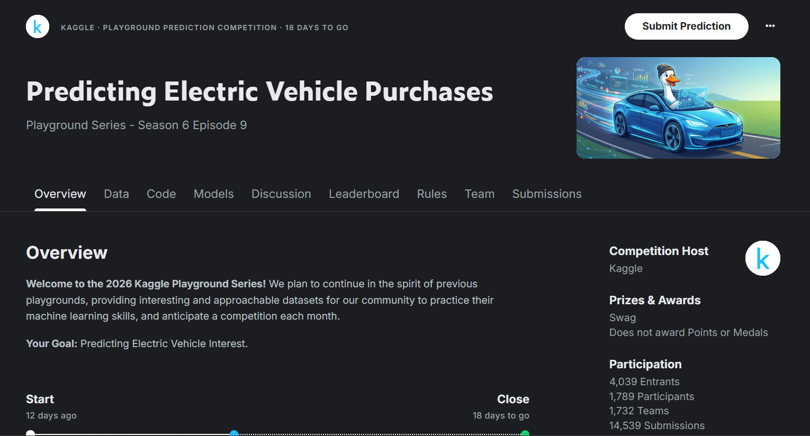
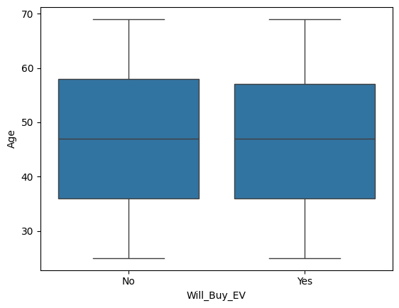
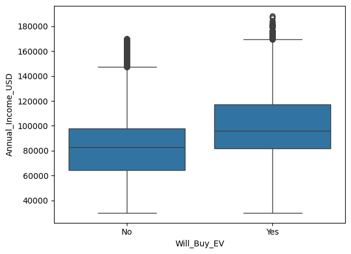
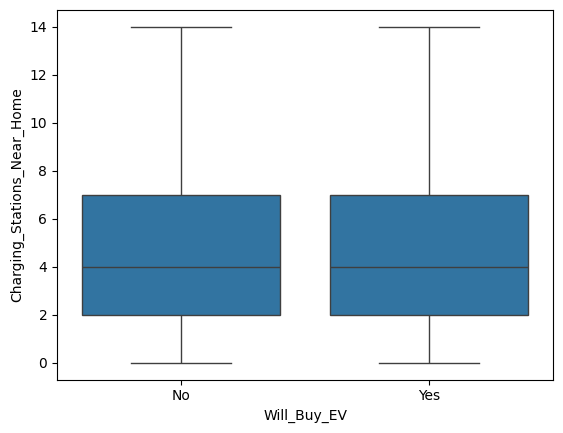

<div align="center">

# Predicting Electric Vehicle Purchases

Modeling consumer intent to buy an EV from tabular behavioral data.

[](https://www.kaggle.com/competitions/playground-series-s6e9)
[](https://www.kaggle.com/competitions/playground-series-s6e9/overview/evaluation)
[](./eda.ipynb)



<a href="https://www.kaggle.com/competitions/playground-series-s6e9"></a>

[Competition](https://www.kaggle.com/competitions/playground-series-s6e9) · [Kaggle Profile](https://www.kaggle.com/Masochistic) · [GitHub](https://github.com/LeadingTheAbyss)

</div>

This repo has the EDA and modeling pipeline for Playground Series S6E9: Predicting Electric Vehicle Purchases. Binary classification: given demographic, financial, and infrastructure features about a person, predict whether they buy an EV (`Will_Buy_EV`).

The notebook covers baselining, feature scaling, model comparison, and the EDA that found the two strongest signals in the data, before landing on a CatBoost model trained on raw categorical features.

## Problem setting

Each row is one person:

- demographics: `Age`, `Gender`, `Annual_Income_USD`
- usage patterns: `Daily_Commute_km`, `Number_of_Cars_Owned`, `Current_Car_Type`
- infrastructure access: `Charging_Stations_Near_Home`, `Charging_Stations_Near_Work`, `Home_Charging_Possible`
- context & incentives: `City_Type`, `Subsidy_Available`, `Environmental_Concern_Level`, `Range_Anxiety_Level`

Target `Will_Buy_EV` is binary (`Yes` / `No`), scored on ROC-AUC.

> [!NOTE]
> Train: 668,665 rows. Test: 286,571 rows. No missing values, no leaked identifiers beyond `id`.

## My Thought Process, Step-Wise

A superficial, pointwise walk through how this project actually unfolded in `eda.ipynb`:

1. Loaded `train.csv`, checked `.head()`, `.describe()`, and `.dtypes` to get a feel for the columns.
2. Tried a **plain logistic regression** on one-hot encoded features. Got 0.90 ROC-AUC.
3. Noticed the columns were on very different scales, so added `StandardScaler`. That jumped it to 0.93.
4. Switched to **XGBoost** (no scaling needed). Reached ~0.94.
5. Tried **CatBoost** too. About the same as XGBoost, close enough not to matter yet.
6. Before tuning further, plotted a few boxplots to see how the data was actually distributed:

   

   Age didn't show an obvious split between buyers and non-buyers.

   

   Income looked more promising. Buyers skew higher.

   

   Charging-station access didn't separate the classes much on its own.

7. Went deeper on income with a quintile crosstab. Purchase probability rose monotonically from 6.5% to 31.3% across quintiles, confirming income as a strong signal.
8. Checked `Subsidy_Available` the same way. Turned out to be even stronger: 0.6% buy without a subsidy vs. 27.5% with one.
9. Built a proper CatBoost baseline on native categoricals (no one-hot encoding) and hit 0.941 ROC-AUC, submitted it (0.94083 on the public LB).
10. Ran 5-fold CV to sanity-check the baseline wasn't a lucky split, then hand-tuned hyperparameters (depth, learning rate, L2, iterations, random strength, bagging temperature) one at a time.
11. **Round 2:** found `id` was leaking train/test membership via adversarial validation, dropped it, added two feature ideas that actually helped (`Income_x_Subsidy`, ordinal range-anxiety), re-tuned, and moved CV from 0.941267 to 0.941841.
12. **Round 3:** a public notebook credited digit decomposition for a big leaderboard jump. Tried it, and it was the single largest gain in the whole project. Added a LightGBM blend on top, landing at 0.943756 CV.

## Baseline: logistic regression

One-hot encode categoricals with `pd.get_dummies`, fit a plain logistic regression: `P(Will_Buy_EV=1 | X) = sigmoid(w·X + b)`.

| Step | ROC-AUC |
|---|---|
| One-hot encoding only | 0.9049 |
| + `StandardScaler` | 0.9384 |

**Why scaling mattered:** logistic regression converges faster and finds a better optimum when features share a comparable scale. `Annual_Income_USD` (range ~30K-190K) was dominating the loss landscape next to binary dummy columns. Standardizing alone added +0.033.

## Moving to gradient boosting

Tree-based models don't need scaling and pick up non-linear interactions (income × subsidy availability) that a linear model misses.

| Model | Config | ROC-AUC |
|---|---|---|
| XGBoost | `n_estimators=300, depth=6, lr=0.05` | 0.9417 |
| CatBoost | `iterations=300, depth=6, lr=0.05` | 0.9409 |

CatBoost trailed XGBoost by 0.0008 here, but this is on one-hot encoded data, before using CatBoost's actual advantage: native categorical handling.

## EDA: finding the signal

### Income is strongly predictive

```
Annual_Income_USD (quintile)     P(Will_Buy_EV = Yes)
(30K, 62.7K]                     0.065
(62.7K, 78.9K]                   0.119
(78.9K, 91.6K]                   0.168
(91.6K, 107.8K]                  0.209
(107.8K, 188.5K]                 0.313
```

Purchase likelihood rises monotonically with income, nearly 5x from bottom to top quintile.

### Subsidy availability is the strongest single feature

```
Subsidy_Available     P(Will_Buy_EV = Yes)
No                     0.006
Yes                    0.275
```

> [!TIP]
> No subsidy, almost nobody buys. With a subsidy, purchase probability jumps ~46x. This one categorical flag carries more separating power than any continuous feature in the dataset.

## Final model: CatBoost on native categoricals

Instead of one-hot encoding, categorical columns (`Gender`, `City_Type`, `Current_Car_Type`, `Home_Charging_Possible`, `Subsidy_Available`, `Range_Anxiety_Level`) go straight into CatBoost via `cat_features`. CatBoost's ordered target statistics handle both high- and low-cardinality categoricals without the dimensionality blow-up of one-hot encoding, and without the leakage naive mean-encoding introduces.

```python
model = CatBoostClassifier(
    iterations = 500,
    learning_rate = 0.05,
    depth = 6,
    random_seed = 42
)
model.fit(X_train, y_train, cat_features = cat_cols)
```

| Pipeline | ROC-AUC |
|---|---|
| One-hot + CatBoost | 0.9409 |
| Native categoricals + CatBoost (final) | 0.9411 |

Public leaderboard top score is 0.946, so this baseline sits about 0.005 behind. Reasonable for a first proper submission.

## Submission

```python
test_predictions = model.predict_proba(test)[:, 1]
submission = pd.DataFrame({
    "id": test["id"],
    "Will_Buy_EV": test_predictions
})
submission.to_csv("submission.csv", index = False)
```

`submission.csv` has two columns: `id` and `Will_Buy_EV` (predicted probability, not a hard label). Matches the competition's expected format.

## Summary

- income and subsidy availability are the two dominant predictors
- scaling matters a lot for linear models, not at all for boosted trees
- CatBoost with native categorical handling narrowly beats XGBoost + one-hot encoding
- baseline that scored 0.94083 on Kaggle: 0.9411 local ROC-AUC, ~0.005 off the public leaderboard top

## Round 2: feature engineering, alternative models, and a leakage fix

Full experiment log (hypotheses, holdout screens, 5-fold confirmations) lives in `eda.ipynb`
under "Feature Engineering & Model Experiments". Headline findings:

- **`id` was leaking train/test split membership.** It was left in the feature set as a plain
  numeric column; test ids (668665+) are strictly higher than all train ids (0-668664), so
  adversarial validation (train-vs-test classifier) scored ~1.0 AUC with `id` carrying 96% of
  the importance. Dropping it brought adversarial-validation AUC down to 0.4992 (~0.5, no real
  drift) and removed a pure overfitting risk.
- **Two feature ideas earned their place:** `Income_x_Subsidy` (income x subsidy-available flag)
  and an ordinal encoding of `Range_Anxiety_Level` (Low/Medium/High -> 0/1/2). Four other ideas
  (charging-infrastructure ratios, affordability ratios, a concern/anxiety cancellation feature,
  a City_Type x Home_Charging combined categorical) came back flat. CatBoost's trees already
  reconstruct most of that signal on their own given enough depth.
- **Hyperparameters were re-tuned for the new feature set** (depth=6, lr=0.1, l2=3,
  iterations=500 beat the old depth=8/iterations=300 config once `id` was gone).
- **XGBoost (even with native categorical splits) and a CatBoost/XGBoost blend were both
  tried.** XGBoost trailed CatBoost, and the blend's marginal gain didn't justify running
  two models for this dataset.
- **Result:** 5-fold CV moved from 0.941267 -> **0.941841** (+0.00057), confirmed (not just a
  single holdout) and decomposed feature-by-feature so the gain is understood, not just chased.

## Round 3: digit decomposition + LightGBM blend

Prompted by a [public notebook](https://www.kaggle.com/competitions/playground-series-s6e9/discussion/741117)
on this exact competition crediting digit decomposition, frequency encoding, and target
encoding for a 0.94590 LB score. Tested all three on top of the round-2 pipeline:

- **Digit decomposition** (splitting `Annual_Income_USD`, `Age`, `Daily_Commute_km` into
  per-digit-place integer columns) was the single largest gain found in this whole project:
  **+0.00137** confirmed with 5-fold CV. Feature importances show `Annual_Income_USD`'s digit
  columns collectively outweigh the raw income column. That's strong evidence this Playground-series
  dataset was generated with a digit-level rule on income, an artifact of synthetic generation
  rather than a real-world pattern, but real and exploitable regardless.
- Frequency encoding and out-of-fold target encoding of categoricals both came back flat.
  CatBoost's native categorical handling already captures that signal.
- LightGBM, tried fresh on the expanded feature set, edged out CatBoost for the first time in
  this project, and a 0.3 CatBoost / 0.7 LightGBM blend beat both individually.

| Stage | 5-fold CV |
|---|---:|
| Original submission (0.94083 on LB) | 0.941267 |
| Round 2 (leakage fix + 2 features + retune) | 0.941841 |
| **Round 3 (+ digit decomposition + LightGBM blend)** | **0.943756** |

**+0.00249 total gain.** The round-3 pipeline (`depth=7, lr=0.07, l2=4, iterations=700`
CatBoost blended 0.3/0.7 with LightGBM `depth=7, lr=0.07, n_estimators=600`) is the
candidate to submit next.

## Closing remarks

> [!IMPORTANT]
> Careful reading of the data went further than reaching for a bigger model. Two crosstabs (`Annual_Income_USD`, `Subsidy_Available` vs. target) explained more of the score than switching between XGBoost and CatBoost ever did. Round 2 reinforced this with a data-leakage bug (`id` in the feature set) being the single biggest fix. Round 3 reinforced it again from the opposite direction: a "boring" numeric column (`Annual_Income_USD`) still had a large amount of signal locked inside its individual digits that no amount of tree depth on the raw value could reach.

Next steps:

- digit decomposition on other numeric columns (`Charging_Stations_Near_Home`/`Near_Work`)
- a stacking meta-model over CatBoost + LightGBM OOF predictions instead of a fixed blend weight
- systematic (Optuna) hyperparameter search now that the feature set is more settled

<div align="center">

[Kaggle](https://www.kaggle.com/Masochistic) · [GitHub](https://github.com/LeadingTheAbyss) · [Competition Page](https://www.kaggle.com/competitions/playground-series-s6e9)

[↑ Back to top](#predicting-electric-vehicle-purchases)

</div>